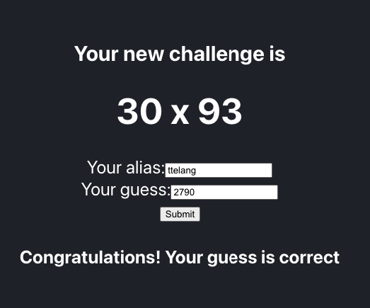

# Learn Microservices with Spring Boot 3 - Chapter 4
This repository contains the source code of the practical use case described in the book [Learn Microservices with Spring Boot 3 (3rd Edition)](https://link.springer.com/book/10.1007/978-1-4842-9757-5).

The book follows a pragmatic approach to building a Microservice Architecture. You start with a small monolith and examine the pros and cons that come with a move to microservices.

## Chapter 4 version

In Chapter 4, you build a basic Web application using React. This frontend connects to the REST API you developed in chapter 3. The backend application with the required CORS configuration addition is also included in this repository.


The main concepts covered in this chapter are:

* Building a React application with TypeScript, explained for Java developers.
* Working with CORS configuration in Spring Boot.
* Connecting the frontend to the REST API.
* Embedding the React application within the Spring Boot JAR file (Tomcat).

This project was bootstrapped with [Create React App](https://github.com/facebook/create-react-app).

## Running the app

Requirements:

* JDK 17
* Node.js v18.6.0
* npm 9.7.1

1. To start the Spring Boot application, you can use the command line with the included Maven wrapper:
    ```bash
    multiplication$ ./mvnw spring-boot:run
    ```
2. The React application can be started with npm. First, you need to download the dependencies with:
    ```bash
    challenges-frontend$ npm install
    ```
3. Then, you start the server with:
    ```bash
    challenges-frontend$ npm start
    ```

Once the backend and the fronted are started, you can navigate to `http://localhost:3000` in your browser and start resolving multiplication challenges. Our MVP is finished!!



## Questions

* Do you have questions about how to make this application work?
* Did you get the book and have questions about any concept explained within this chapter?
* Have you found issues using updated dependencies?

Don't hesitate to create an issue in this repository and post your question/problem there. 

## About the book

Are you interested in building a microservice architecture from scratch? You'll face all the challenges of designing and implementing a distributed system one by one, and will be able to evaluate if it's the best choice for your project.

## Available Scripts

In the project directory, you can run:

### `npm start`

Runs the app in the development mode.\
Open [http://localhost:3000](http://localhost:3000) to view it in your browser.

The page will reload when you make changes.\
You may also see any lint errors in the console.

### `npm test`

Launches the test runner in the interactive watch mode.\
See the section about [running tests](https://facebook.github.io/create-react-app/docs/running-tests) for more information.

### `npm run build`

Builds the app for production to the `build` folder.\
It correctly bundles React in production mode and optimizes the build for the best performance.

The build is minified and the filenames include the hashes.\
Your app is ready to be deployed!

See the section about [deployment](https://facebook.github.io/create-react-app/docs/deployment) for more information.

### `npm run eject`

**Note: this is a one-way operation. Once you `eject`, you can't go back!**

If you aren't satisfied with the build tool and configuration choices, you can `eject` at any time. This command will remove the single build dependency from your project.

Instead, it will copy all the configuration files and the transitive dependencies (webpack, Babel, ESLint, etc) right into your project so you have full control over them. All of the commands except `eject` will still work, but they will point to the copied scripts so you can tweak them. At this point you're on your own.

You don't have to ever use `eject`. The curated feature set is suitable for small and middle deployments, and you shouldn't feel obligated to use this feature. However we understand that this tool wouldn't be useful if you couldn't customize it when you are ready for it.

## Learn More

You can learn more in the [Create React App documentation](https://facebook.github.io/create-react-app/docs/getting-started).

To learn React, check out the [React documentation](https://reactjs.org/).

### Code Splitting

This section has moved here: [https://facebook.github.io/create-react-app/docs/code-splitting](https://facebook.github.io/create-react-app/docs/code-splitting)

### Analyzing the Bundle Size

This section has moved here: [https://facebook.github.io/create-react-app/docs/analyzing-the-bundle-size](https://facebook.github.io/create-react-app/docs/analyzing-the-bundle-size)

### Making a Progressive Web App

This section has moved here: [https://facebook.github.io/create-react-app/docs/making-a-progressive-web-app](https://facebook.github.io/create-react-app/docs/making-a-progressive-web-app)

### Advanced Configuration

This section has moved here: [https://facebook.github.io/create-react-app/docs/advanced-configuration](https://facebook.github.io/create-react-app/docs/advanced-configuration)

### Deployment

This section has moved here: [https://facebook.github.io/create-react-app/docs/deployment](https://facebook.github.io/create-react-app/docs/deployment)

### `npm run build` fails to minify

This section has moved here: [https://facebook.github.io/create-react-app/docs/troubleshooting#npm-run-build-fails-to-minify](https://facebook.github.io/create-react-app/docs/troubleshooting#npm-run-build-fails-to-minify)

## Purchase
You can buy the book online from these stores:
* [Apress](https://link.springer.com/book/10.1007/978-1-4842-9757-5)
* [Amazon](https://www.amazon.com/Learn-Microservices-Spring-Boot-Containerization/dp/1484297563)
and other online stores
