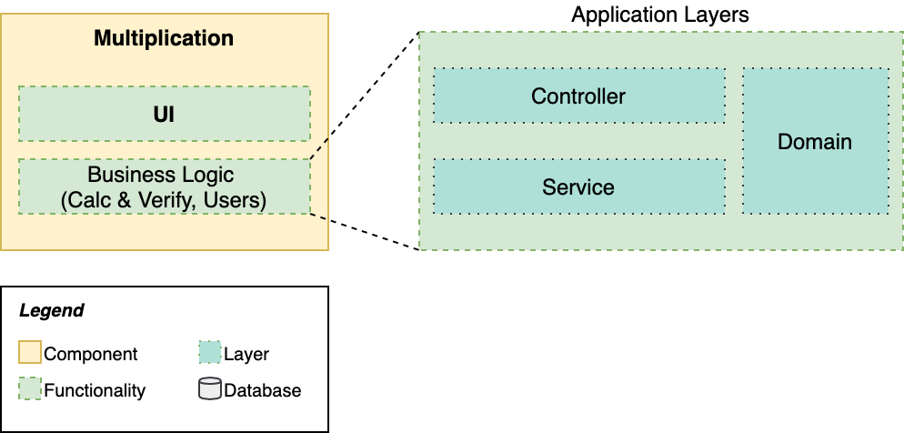

# Learn Microservices with Spring Boot 3 - Chapter 4
This repository contains the source code of the practical use case described in the book [Learn Microservices with Spring Boot 3 (3rd Edition)](https://link.springer.com/book/10.1007/978-1-4842-9757-5).

The book follows a pragmatic approach to building a Microservice Architecture. You start with a small monolith and examine the pros and cons that come with a move to microservices.

## Chapter 4 version

In Chapter 4, you build a basic Web application using React. This frontend connects to the REST API you developed in chapter 3. The backend application with the required CORS configuration addition is also included in this repository.



The main concepts covered in this chapter are:

* Building a React application with TypeScript, explained for Java developers.
* Working with CORS configuration in Spring Boot.
* Connecting the frontend to the REST API.
* Embedding the React application within the Spring Boot JAR file (Tomcat).

## Running the app

Requirements:

* JDK 17
* Node.js v18.6.0
* npm 9.7.1

1. To start the Spring Boot application, you can use the command line with the included Maven wrapper:
    ```bash
    multiplication$ ./mvnw spring-boot:run
    ```
2. The React application can be started with npm. First, you need to download the dependencies with:
    ```bash
    challenges-frontend$ npm install
    ```
3. Then, you start the server with:
    ```bash
    challenges-frontend$ npm start
    ```

Once the backend and the fronted are started, you can navigate to `http://localhost:3000` in your browser and start resolving multiplication challenges. Our MVP is finished!!


## Questions

* Do you have questions about how to make this application work?
* Did you get the book and have questions about any concept explained within this chapter?
* Have you found issues using updated dependencies?

Don't hesitate to create an issue in this repository and post your question/problem there. 

## About the book

Are you interested in building a microservice architecture from scratch? You'll face all the challenges of designing and implementing a distributed system one by one, and will be able to evaluate if it's the best choice for your project.

## Purchase
You can buy the book online from these stores:
* [Apress](https://link.springer.com/book/10.1007/978-1-4842-9757-5)
* [Amazon](https://www.amazon.com/Learn-Microservices-Spring-Boot-Containerization/dp/1484297563)
and other online stores
